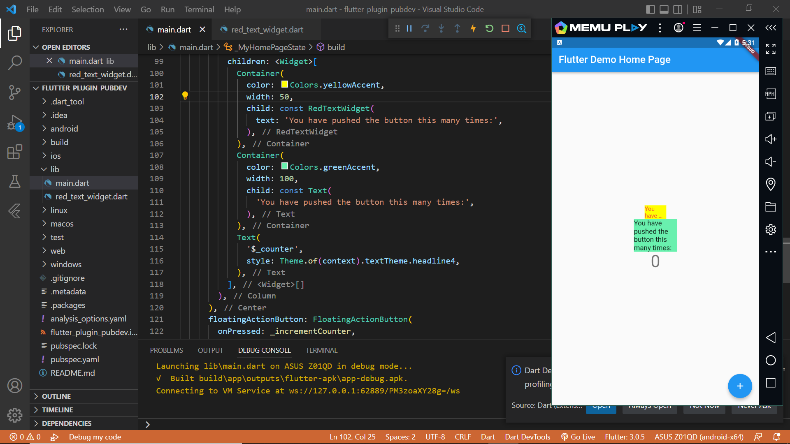

# Tugas Praktikum

## 1. Hasil Praktikum

## 2. Penjelasan Langkah 2
Pada langkah 2 yaitu menambahkan plugin auto_size_text untuk digunakan pada red_text_widget.dart dalam mengubah ukuran teks secara otomatis

## 3. Penjelasan Langkah 5
AutoSizeText membutuhkan sebuah parameter berupa text , untuk itulah string text dibuat agar nanti digunakan pada AutoSizeText 

## 4. Pada langkah 6 terdapat dua widget yang ditambahkan, jelaskan fungsi dan perbedaannya!

Fungsinya : Untuk menampilkan sebuah teks pada layar
Perbedaannya : Pada Container pertama menggunakan widget AutoSizeText dan yang kedua menggunakkan widget teks. 

## 5. Jelaskan maksud dari tiap parameter yang ada di dalam plugin auto_size_text
key*        :Mengontrol bagaimana satu widget menggantikan widget lain pada sebuah tree.
textKey     :Mengatur kunci untuk widget Teks yang dihasilkan
style*      :Sebuah style yang digunakan pada teks jika bukan null
minFontSize  :Batasan ukuran teks minimum yang akan digunakan saat mengubah ukuran teks secara otomatis.
Diabaikan jika presetFontSizes diatur.

maxFontSize  :Batasan ukuran teks maksimum yang akan digunakan saat mengubah ukuran teks secara otomatis.
Diabaikan jika presetFontSizes diatur.

stepGranularity :Ukuran langkah di mana ukuran font sedang disesuaikan dengan constraints.
presetFontSizes :Mendefinisikan semua ukuran font yang mungkin. presetFontSizes harus dalam urutan menurun

grup            :Menyinkronkan ukuran beberapa AutoSizeTexts
textAlign*      :Bagaimana teks harus disejajarkan secara horizontal.
textDirection*  :Arahan teks. Ini memutuskan bagaimana nilai textAlign seperti TextAlign.start dan TextAlign.end diinterpretasikan.

locale* :Digunakan untuk memilih font ketika karakter Unicode yang sama dapat dirender secara berbeda, tergantung pada lokal.

softWrap* :Apakah teks harus putus saat soft line breaks.
wrapWords :Apakah kata-kata yang tidak muat dalam satu baris harus dibungkus. Default ke true untuk berperilaku seperti Teks.

overflow* :Bagaimana visual overflow harus ditangani.
overflowReplacement :Jika teks meluap dan tidak sesuai dengan batasnya, widget ini akan ditampilkan sebagai gantinya.

textScaleFactor* :Jumlah piksel font untuk setiap piksel logis. Juga memengaruhi minFontSize, maxFontSize, dan presetFontSizes.

maxLines :Jumlah maksimum baris opsional untuk teks yang akan dibentangkan.
semanticsLabel* :Label semantik alternatif untuk teks ini.

Parameter yang ditandai dengan * berperilaku persis sama seperti di Teks